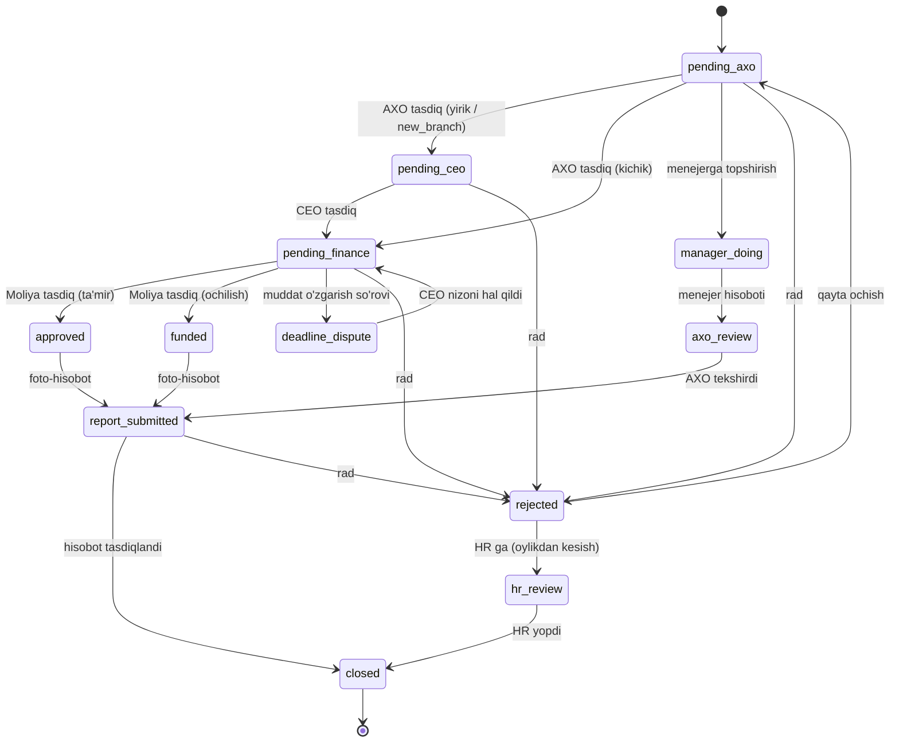

# Workflow State Machine — Spend Management (Open Group + AXO)

Bu — `src/lib/workflow-transitions.ts` dagi grafning vizual ko'rinishi. Kod bilan
1:1 mos (test `workflow-transitions.test.ts` buni tekshiradi).

## Diagramma

## Audit topilmasi (actions.ts ↔ graf 1:1)

`actions.ts` dagi BARCHA status o'zgarishlari grafga mos (drift-test tasdiqlaydi), bitta nozik holat bilan:

- **CEO/admin favqulodda rad etish (override):** `rejectAction` guard'i `canApprove YOKI ceo/admin`
  bo'lgani uchun CEO/admin **jarayondagi** holatlardan ham (approved, funded, manager_doing,
  axo_review, deadline_dispute) rad eta oladi. Graf shu haqiqatni aks ettiradi (`→ rejected`).
- **⚠️ Ochiq xavf:** guard terminal holatni (closed) istisno qilmaydi — ya'ni CEO/admin
  texnik jihatdan **yopilgan** zayavkani ham rejected qila oladi. Bu grafga KIRITILMAGAN
  (noto'g'ri deb baholanadi). Tavsiya: deploy ochilgach `rejectAction` guard'ini
  `!isTerminal(status)` bilan cheklash (runtime o'zgarishi — hozir emas).

Boshqa barcha transition (approve/report/reopen/hr/dispute/delegate) graf bilan 100% mos.

## Business Lifecycle bilan moslik (gap analiz)

Universal Lifecycle (9 bosqich) ↔ hozirgi kod holatlari:

| Lifecycle bosqich | Hozirgi kod holati | Holat |
|---|---|---|
| Need | so'rov yaratish (pending_axo) | ✅ bor |
| Commitment | — | ⚠️ alohida yo'q (byudjet rezervi implitsit) |
| Approval | pending_axo → pending_ceo → pending_finance | ✅ bor (3 bosqichli) |
| Funding | approved / funded (limit/pul) | 🟡 qisman (Treasury alohida emas) |
| Execution | ijro (approved/funded) | ✅ bor |
| Evidence | foto-hisobot (report) | ✅ bor |
| Inspection | — | ⚠️ mustaqil qabul/QC yo'q |
| Settlement | hisobot tasdiqlash | 🟡 qisman (avans/to'lov reconciliation yo'q) |
| Closure | closed | ✅ bor |

**Xulosa:** kod Lifecycle'ning "yadro" oqimini (Need→Approval→Execution→Evidence→Closure)
qamraydi. **Yetishmayotgani:** Commitment (byudjet rezervi), Inspection (mustaqil qabul),
Settlement (avans/to'lov). Bular Blueprint bo'yicha keyingi bosqichlarda (Money/Procurement/
Advance modullari) qo'shiladi — hozirgi kodni buzmasdan, konfiguratsiya orqali.
